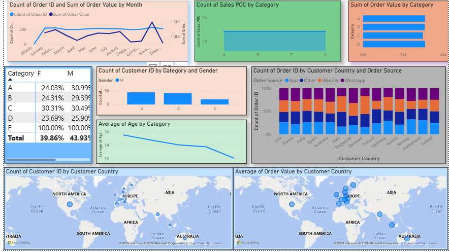
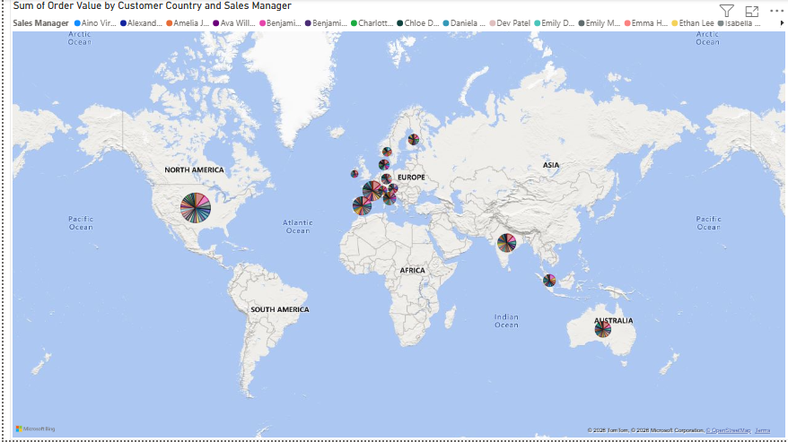
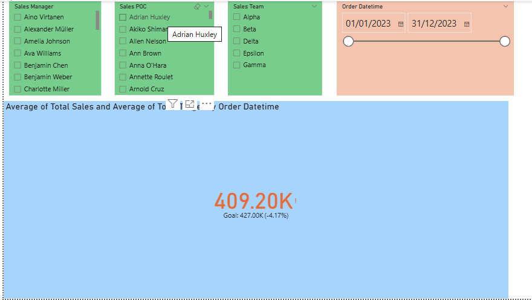
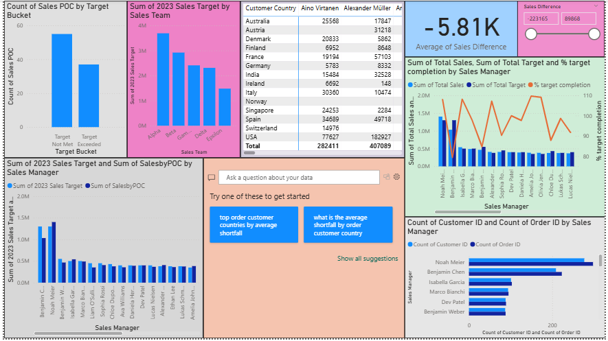
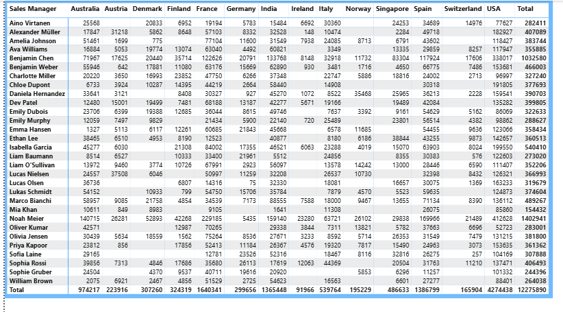

# E-Commerce Sales Dashboard | Power BI

## 📌 Project Overview

An interactive Power BI dashboard designed to analyze e-commerce sales performance, customer behavior, order activity, sales targets, sales-team performance, and geographic sales distribution.

The project demonstrates an end-to-end Power BI workflow using **Power Query, data modeling, DAX, KPI design, and interactive visualizations**.

---

## 🎯 Business Objectives

- Monitor overall sales and order performance
- Analyze sales performance by country
- Track sales targets and performance against targets
- Evaluate sales-team performance
- Understand order trends and customer behavior
- Identify high-performing markets and sales areas
- Present business KPIs through an interactive dashboard

---

## 🛠 Tools & Technologies

- **Power BI Desktop**
- **Power Query** — data cleaning and transformation
- **DAX** — calculated measures and KPIs
- **Data Modeling** — relationships and analytical model
- **Interactive Data Visualization**

---

## 📊 Dashboard Areas

### 1. Sales Performance

Provides an overview of sales performance and key business KPIs.

### 2. Orders Analysis

Analyzes order activity and helps identify patterns in order performance.

### 3. Geographic Sales Analysis

Uses country-level visualizations to understand where sales are being generated and compare market performance.

### 4. Sales Target Analysis

Compares actual sales performance with sales targets to support performance monitoring.

### 5. Sales Team Analysis

Provides a view of sales performance across the sales team and helps identify stronger and weaker contributors.

---

## 🖼️ Dashboard Preview

### Sales & Orders



### Sales by Country



### Sales Target Performance



### Sales Team Performance



### Additional Country View



---

## 🔍 Key Analytical Questions

The dashboard is designed to answer questions such as:

1. How is overall sales performance trending?
2. Which countries contribute most to sales?
3. How are actual sales performing against targets?
4. Which members of the sales team are performing strongly?
5. How does order activity vary across the business?
6. Which markets or sales areas may require additional attention?

---

## 📈 Power BI Skills Demonstrated

### Data Preparation

- Data import
- Data cleaning
- Data transformation using Power Query
- Data-type handling
- Preparing data for analysis

### Data Modeling

- Table relationships
- Building an analytical data model
- Creating a model suitable for interactive reporting

### DAX

- Calculated measures
- KPI calculations
- Aggregation and business metrics
- Measures used for dashboard reporting

### Visualization

- KPI cards
- Charts
- Geographic analysis
- Target vs. actual analysis
- Sales-team performance views
- Interactive dashboard design

---

## 📁 Repository Contents

```text
power-bi-ecommerce-sales-dashboard/
│
├── E Commerce Order.pbix
├── README.md
├── orders.png
├── sales_by_country.png
├── SM_sales_by_country.png
├── sales_target.png
├── sales_team.png
└── Screenshots
```

---

## ▶️ How to Use the Project

1. Download **E Commerce Order.pbix**.
2. Open it using **Microsoft Power BI Desktop**.
3. Review the data model, Power Query transformations, and DAX measures.
4. Navigate through the dashboard pages and interact with the visuals and filters.

> Note: The `.pbix` file is included so recruiters and reviewers can inspect the Power BI implementation directly.

---

## 💼 Business Value

This dashboard converts raw e-commerce data into an interactive reporting solution that can help stakeholders monitor sales performance, identify geographic opportunities, evaluate sales-team performance, and track progress against targets.

---

## 👨‍💻 Author

**Manas Gupta**  
Data Analyst | SQL | Python | Excel | Power BI

GitHub: https://github.com/manasgupta2198
